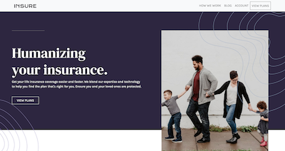
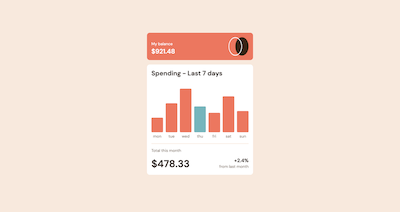

# Adam Mckee
**Front End Developer**  
Im currently working on a custom portfolio site. In the mean time feel free to browse through the following projects I have worked on lately. More to come. Other projects can be views via my repos. Feel free to view my [resume](https://drive.google.com/file/d/1EguQC-1_gt5fCPfdjZRzqTpk5mBptzFc/view) as well. Thanks!

>
## Recent Projects  

### Audiophile Multipage E-commerce site
  
Mock e-commerce multipage website  
| [Project info/Code](https://github.com/atmkcmo/audiophile) | 
[Live site](https://atmkcmo.github.io/audiophile/) |

### E-commerce Page
  
Mock e-commerce page build to match design and functionality of an real web page.  
| [Project info/Code](https://github.com/atmkcmo/FM-ecommerce-product-page) | 
[Live site](https://atmkcmo.github.io/FM-ecommerce-product-page/) |

### Where in the World App
  
Web app where user can view flags and stats from counties around the world. Utilzes REST Countries API.  
| [Project info/Code](https://github.com/atmkcmo/where-in-the-world) | 
[Live site](https://atmkcmo.github.io/where-in-the-world/) |

### Mock Insurance Landing Page
  
Mock insurance pixel perfect landing page build.  
| [Project info/Code](https://github.com/atmkcmo/FM-insure-landing-page) | 
[Live site](https://atmkcmo.github.io/FM-insure-landing-page/) |  
  
  
### Expenses Component
  
Expenses component build with JSON date and JS.  
| [Project info/Code](https://github.com/atmkcmo/FM-expenses-chart-component) | 
[Live site](https://atmkcmo.github.io/FM-expenses-chart-component/) |  
  
  
To see more projects pleaese see my other [repos](https://github.com/atmkcmo?tab=repositories)

## Technology

Here are some of the technolgies I like use to create web experiences

- Javascript
- Sass
- Vue.js
- Vite
- Git
- Node
- Axios
- Parcel
- Bootstrap
- Foundation

I am currently working on adding learning React and adding that to that list.

## Contact

phone: 347.693.8070  
email: amckeee@gmail.com  
linkedin: [Adam Mckee](https://www.linkedin.com/in/admckee/)  
Resume: [Adam Mckee Resume](https://drive.google.com/file/d/1EguQC-1_gt5fCPfdjZRzqTpk5mBptzFc/view)
<!--
**atmkcmo/atmkcmo** is a ✨ _special_ ✨ repository because its `README.md` (this file) appears on your GitHub profile.

Here are some ideas to get you started:

- 🔭 I’m currently working on ...
- 🌱 I’m currently learning ...
- 👯 I’m looking to collaborate on ...
- 🤔 I’m looking for help with ...
- 💬 Ask me about ...
- 📫 How to reach me: ...
- 😄 Pronouns: ...
- ⚡ Fun fact: ...
-->
