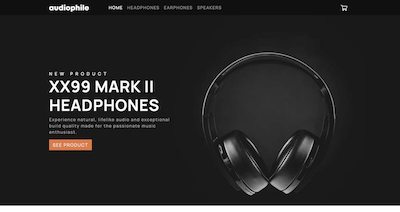
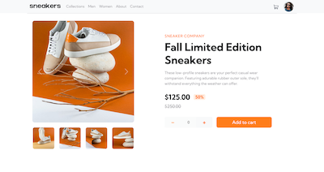
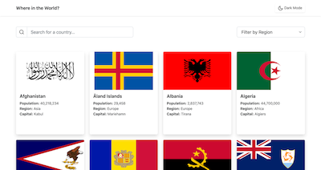
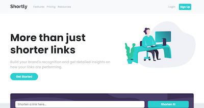

# Hi, my name is Adam McKee
I am a detail-oriented Front End Web Developer advancing knowledge in web application design, performance, creation, and usability. Able to work successfully in a team environment as well as effectively manage oneself during independent initiatives. 

Im currently available for freelance, contract or full time employment. Feel free to reach me at amckeee@gmail.com.  

 

## Recent Projects  

 

### Audiophile Multipage E-commerce site  
  
Mock audio e-commerce SPA, built with Vue.  
| [Project info/Code](https://github.com/atmkcmo/audiophile) | 
[Live site](https://atmkcmo.github.io/audiophile/) |

 

### Sneakers E-commerce Page
  
Mock designer shoe e-commerce web page.  
| [Project info/Code](https://github.com/atmkcmo/FM-ecommerce-product-page) | 
[Live site](https://atmkcmo.github.io/FM-ecommerce-product-page/) |

 

### Where in the World App
  
Flag and Country Info app utilizing REST Countries API.  
| [Project info/Code](https://github.com/atmkcmo/where-in-the-world) | 
[Live site](https://atmkcmo.github.io/where-in-the-world/) |

 

### Shortly URL Landing Page
  
Url shortenling landing page intergrated with shrtcode API.  
| [Project info/Code](https://github.com/atmkcmo/FM-shortly-URL) | 
[Live site](https://atmkcmo.github.io/FM-shortly-URL/) |  
  
  

## Technology

Here are some of the technolgies I like use to create fantastic web experiences:

 

 

## Contact

Feel free to contact me to discuss Frontend Devleopment, projects, drums, recipes, sandwich shop recommendations, etc.  

 

cell: (347) 693-8070  
email: amckeee@gmail.com  
linkedin: [Adam Mckee](https://www.linkedin.com/in/admckee/)  
Resume: [Adam Mckee Resume](https://drive.google.com/file/d/1EguQC-1_gt5fCPfdjZRzqTpk5mBptzFc/view)
<!--
**atmkcmo/atmkcmo** is a ✨ _special_ ✨ repository because its `README.md` (this file) appears on your GitHub profile.

Here are some ideas to get you started:

- 🔭 I’m currently working on ...
- 🌱 I’m currently learning ...
- 👯 I’m looking to collaborate on ...
- 🤔 I’m looking for help with ...
- 💬 Ask me about ...
- 📫 How to reach me: ...
- 😄 Pronouns: ...
- ⚡ Fun fact: ...
-->
